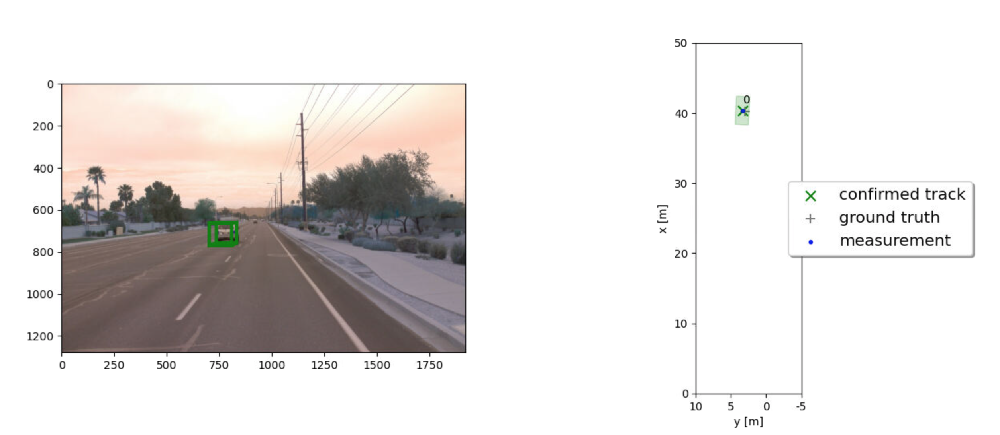
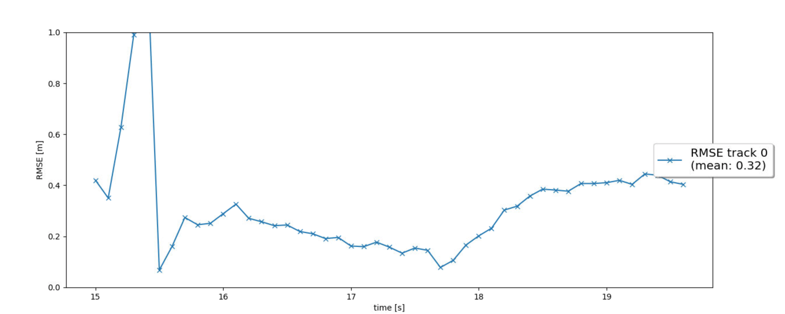
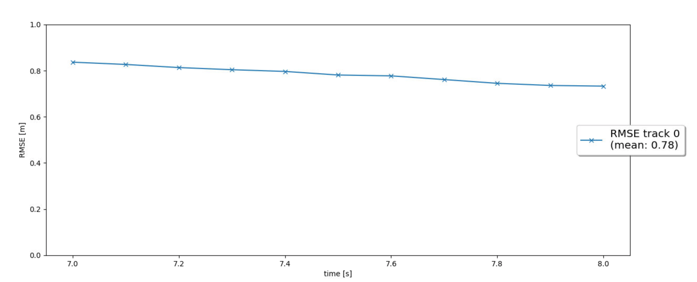
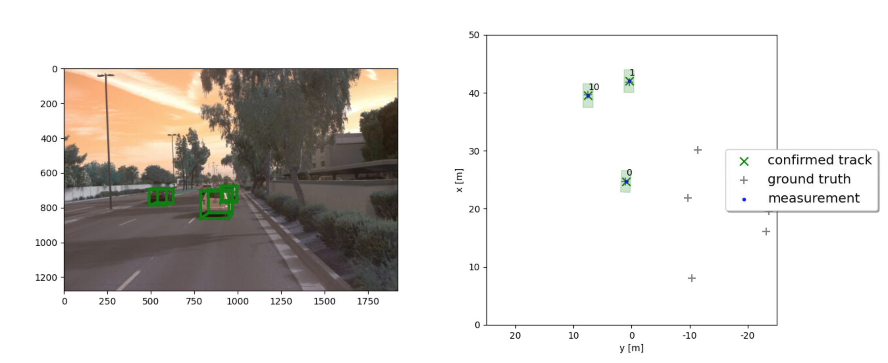
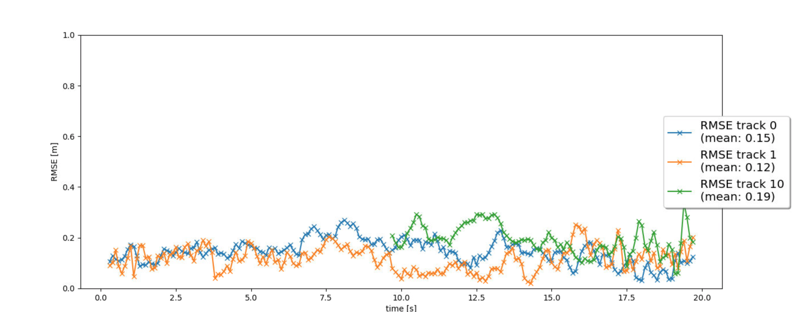
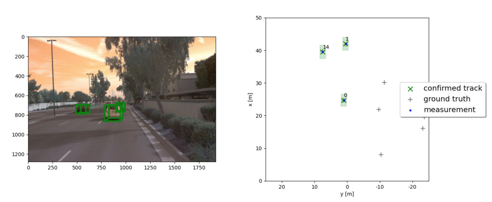
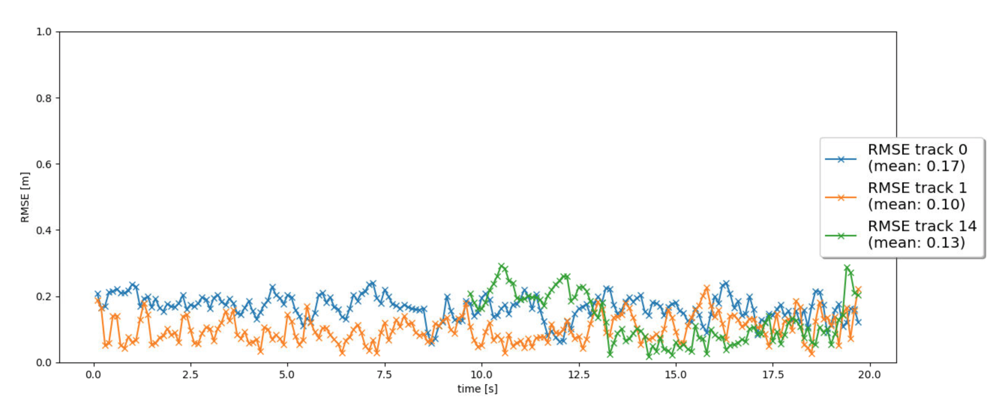

# Writeup: Track 3D-Objects Over Time

Please use this starter template to answer the following questions:

### 1. Write a short recap of the four tracking steps and what you implemented there (filter, track management, association, camera fusion). Which results did you achieve? Which part of the project was most difficult for you to complete, and why?
#### Step 1: filter
- Implement the `predict()` function for an EKF. Implement the `F()` and `Q()` functions to calculate a system matrix for constant velocity process model in 3D and the corresponding process noise covariance depending on the current timestep dt.
- Implement the `update()` function as well as the `gamma()` and `S()` functions for residual and residual covariance.

  Result:

  | **Track image** | **RMSE plot** |
  |     :---:     |     :---:      | 
  |  |  |

#### Step 2: track management
- In the `Track` class, replace the fixed track initialization values by initialization of `track.x` and `track.P`.
- In the `Trackmanagement` class, implement the `manage_tracks()` function:
  - Decrease the track score for unassigned tracks.
  - Delete tracks if the score is too low or P is too big.
- In the `Trackmanagement` class, implement the `handle_updated_track()` function:
  - Increase the track score for the input `track`.
  - Set the track state to 'tentative' or 'confirmed' depending on the track score.
  
  Result:
  
  
  
#### Step 3: association
- In the `Association` class, implement the `associate()` function:
  - Replace `association_matrix` with the actual association matrix.
    - Use the `MHD()`function to implement the Mahalanobis distance.
    - Use the `gating()` function to check if a measurement lies inside a track's gate. 
  - Update the list of unassigned measurements `unassigned_meas` and unassigned tracks `unassigned_tracks`.
- In the `Association` class, implement the `get_closest_track_and_meas()` function:
  - Find the minimum entry in `association_matrix`, delete corresponding row and column from the matrix.
  - Remove corresponding track and measurement from `unassigned_tracks` and `unassigned_meas`.
  - Return this association pair between track and measurement. 

  Result:

  | **Track image** | **RMSE plot** |
  |     :---:     |     :---:      | 
  |  |  |
  
#### step 4: camera fusion
- In the `Sensor` class, implement the function `in_fov()`.
- In the `Sensor` class, implement the function `get_hx()` with the nonlinear camera measurement function h.
- In the `Sensor` class, simply remove the restriction to lidar in the function `generate_measurement()`
- In the `Measurement` class, initialize camera measurement objects including `z`, `R`, and the sensor object `sensor`.

  Result:

  | **Track image** | **RMSE plot** |
  |     :---:     |     :---:      | 
  |  |  |
  
For me, the track management part is the most challenging task. Becasue you need to deal with multi-track states and delete a gost track as soon as possible by define a poper threshold. more over, due to the sensor have different field of view or sensor failure. the track score might be oscillating.

### 2. Do you see any benefits in camera-lidar fusion compared to lidar-only tracking (in theory and in your concrete results)? 
Yes, camera fusion is the complementary to the lidar tracking. The camera is good at classification, while lidar is good at spatial resolution and also robust for bad environment condition. Every sensor has advantages and disadvantages and may fail sometime. sensor fusion will improve the reliability of the environment perception. 
from the result, we can also see the improvement of RMSE.

### 3. Which challenges will a sensor fusion system face in real-life scenarios? Did you see any of these challenges in the project?
In real_life scenarios, it's more complicate. such as pedestrains, bicycles which we have not been considered in this project. pedestrains and bicycles 
have more uncertainy, which can move to any direction.

### 4. Can you think of ways to improve your tracking results in the future?
- Apply the standard deviation values for lidar that found in the mid-term project. 
- Implement a more advanced data association, such as GNN, JPDA
- Adapt the Kalman filter to also estimate the object's width, length, and height, instead of simply using the unfiltered lidar detections as we did.
- Use a non-linear motion model, e.g. a bicycle model, which is more appropriate for vehicle movement than our linear motion model, since a vehicle can only move forward or backward, not in any direction.

