# Mid-term project:3D object detection
## project overview

 In this project, a deep-learning approach is used to detect vehicles in LiDAR data based on a birds-eye view perspective of the 3D point-cloud. 
 Also, a series of performance measures is used to evaluate the performance of the detection approach.

## Section 1 :Compute Lidar Point-Cloud from Range Image
- **Visualize range image channels**

  In the Waymo Open dataset, lidar data is stored as a range image. we need to extract the data from `range` and `intensity` channels within range image.
  Then convert the floating-point data to an 8-bit integer value.
  
    ***Image display***
    
    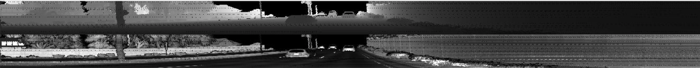
   
- **Visualize lidar point-cloud**

  This task is to use the Open3D library to display the lidar point-cloud in a 3d viewer.
  
    ***varying degrees of visibility***
    
    | 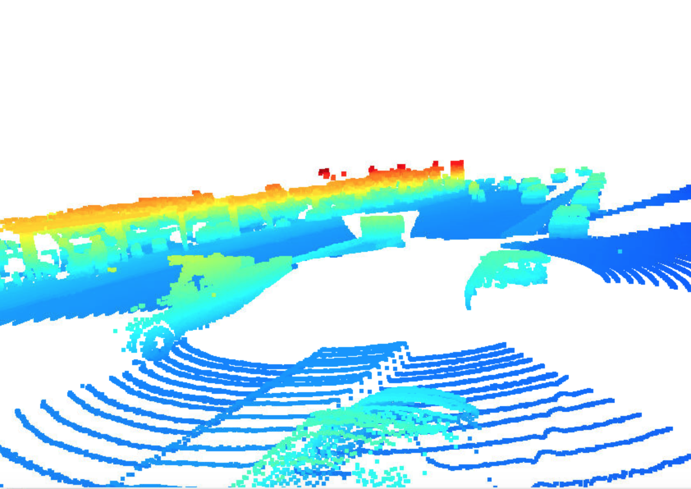 | 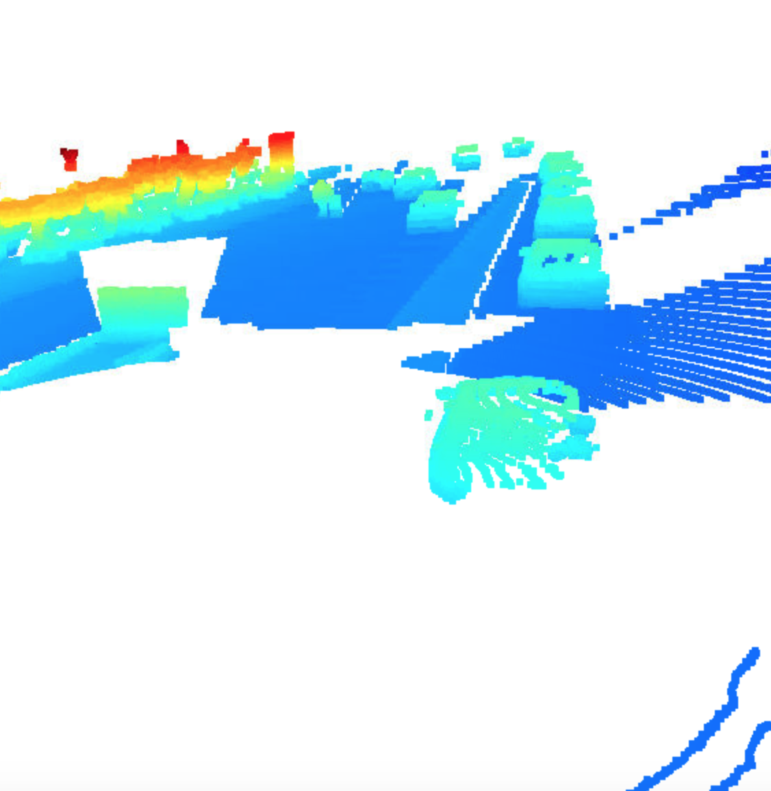 |
    |     :---:     |     :---:      |
    | 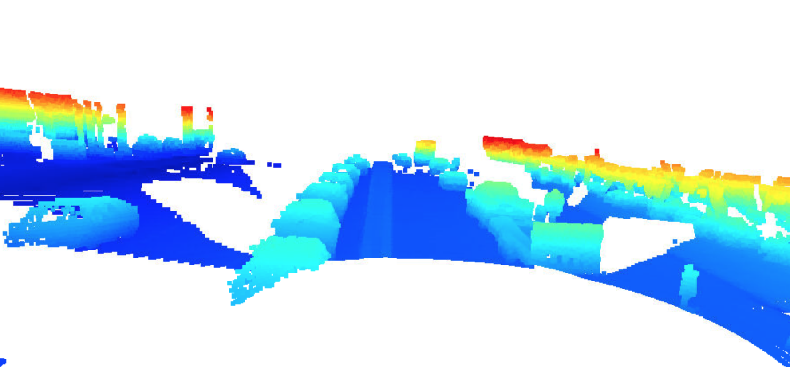 | 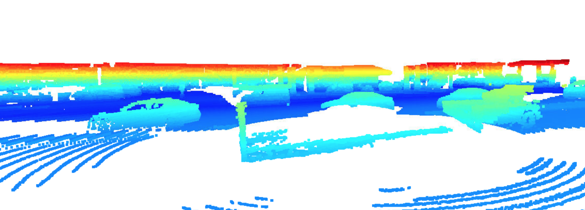 |
    | 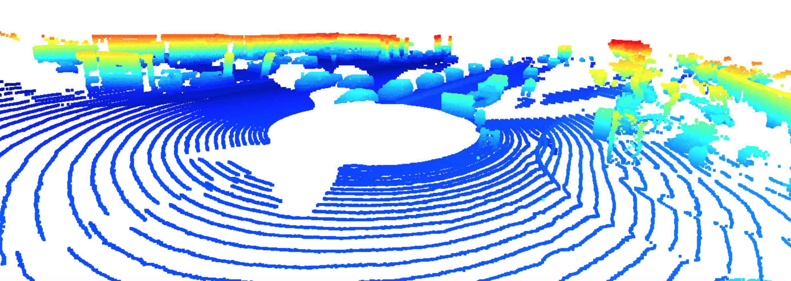 | 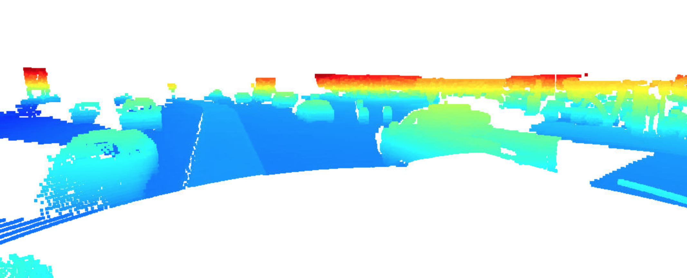 |

## Section 2 : Create Birds-Eye View from Lidar PCL
- **Convert sensor coordinates to BEV-map coordinates**

  ***Image display***
  
  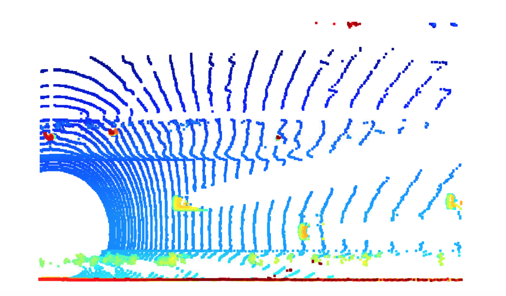

- **Compute intensity layer of the BEV map**

  ***Image display***
  
  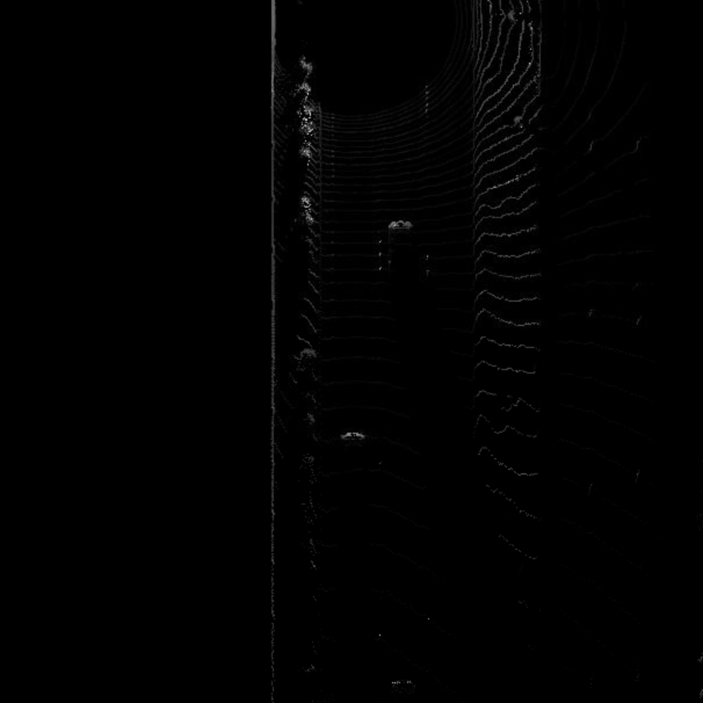
  
- **Compute height layer of the BEV map**

  ***Image display***
  
  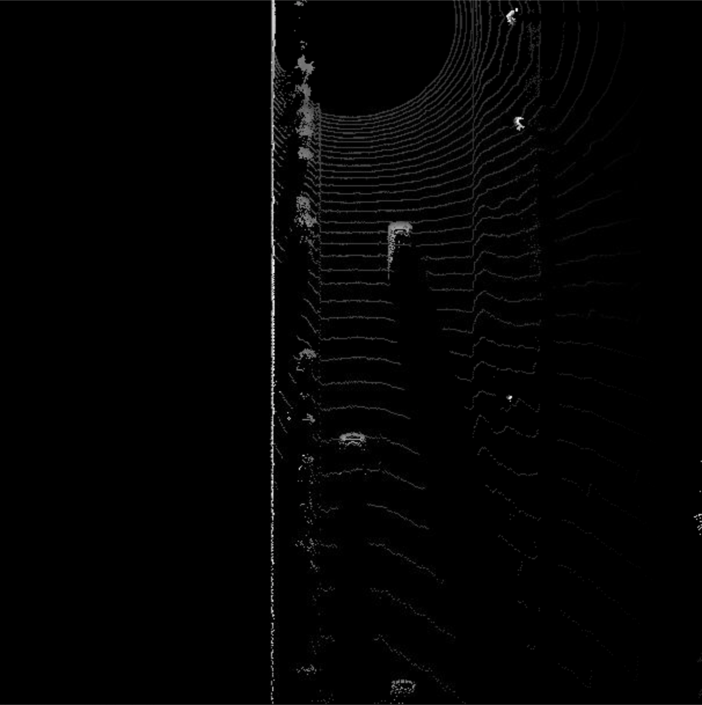

## Section 3 : Model-based Object Detection in BEV Image
- **Add a second model from a GitHub repo**

  This task is to integrate `fpn_resnet` into an existing framework

  ***Result***
  
  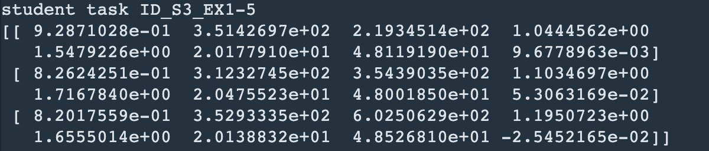

- **Extract 3D bounding boxes from model response**

  ***Image display***
  
  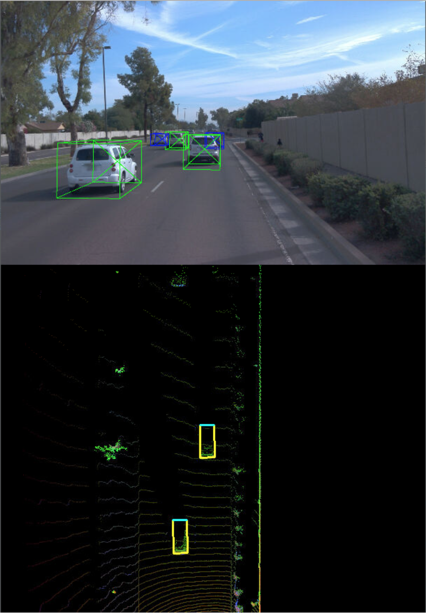
  
## Section 4 : Performance Evaluation for Object Detection
- **Compute intersection-over-union between labels and detections**
- **Compute false-negatives and false-positives**
- **Compute precision and recall**

***Image display***

   | `configs_det.use_labels_as_objects = False` | `configs_det.use_labels_as_objects = True` |
   |     :---:     |     :---:      |
   | 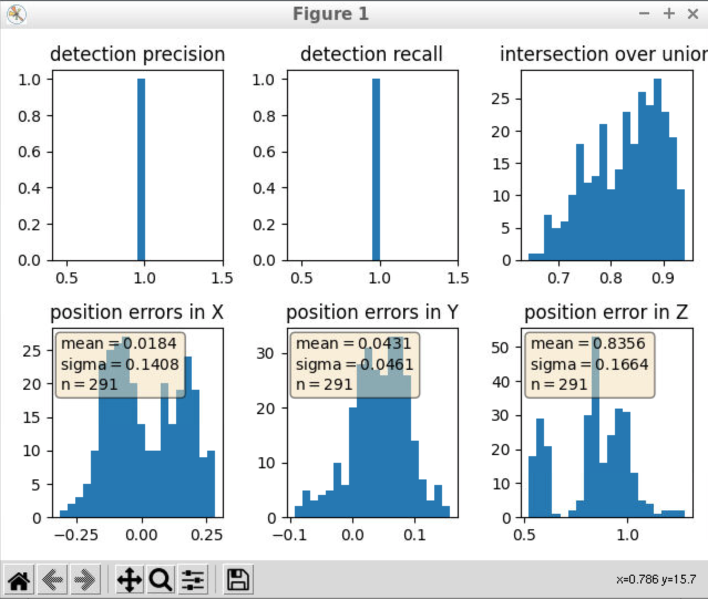 | 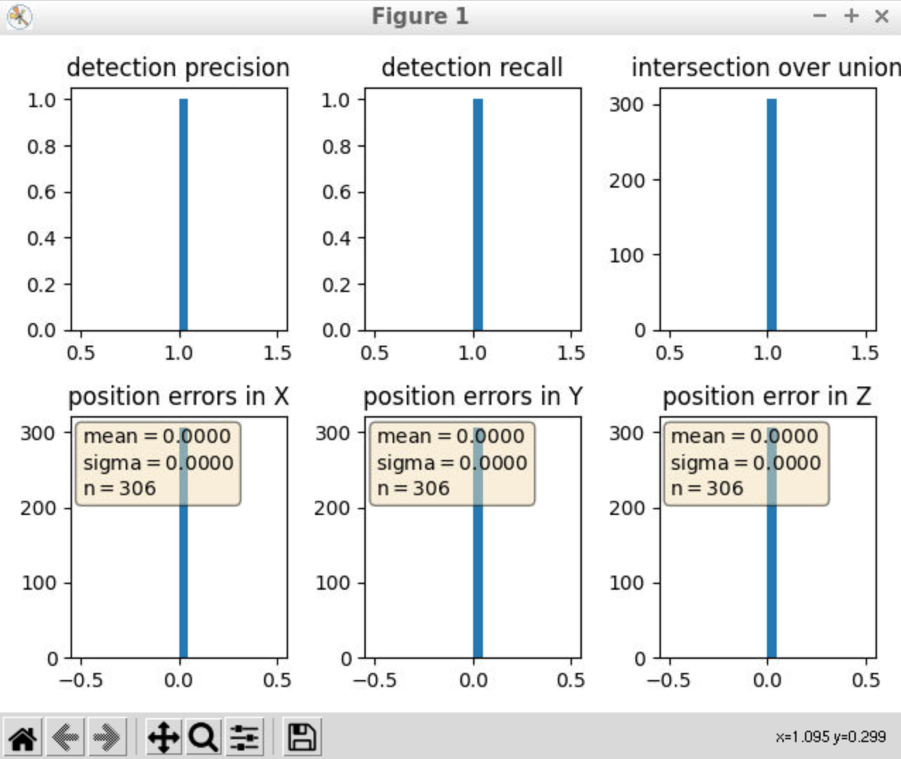 |
   | **precision = 0.95409, recall = 0.95098** | **precision = 1.0, recall = 1.0** |

